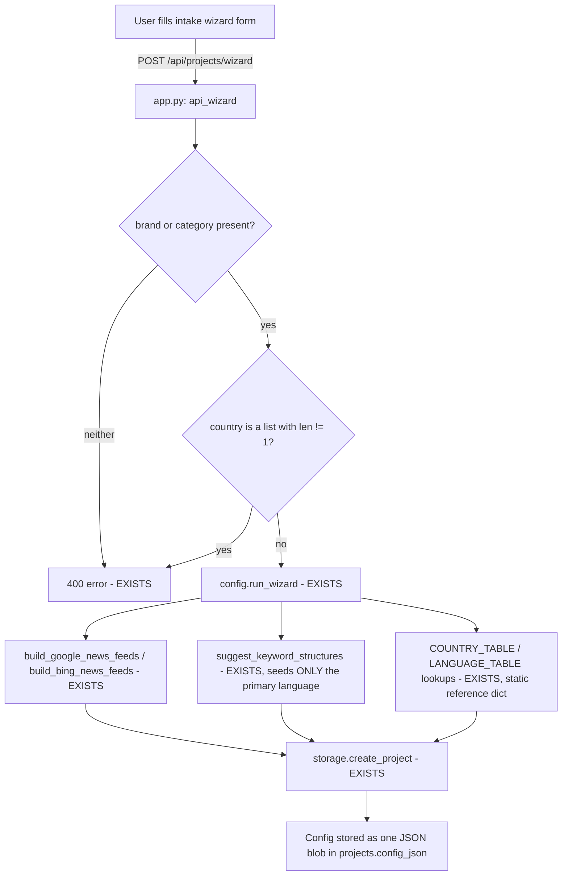
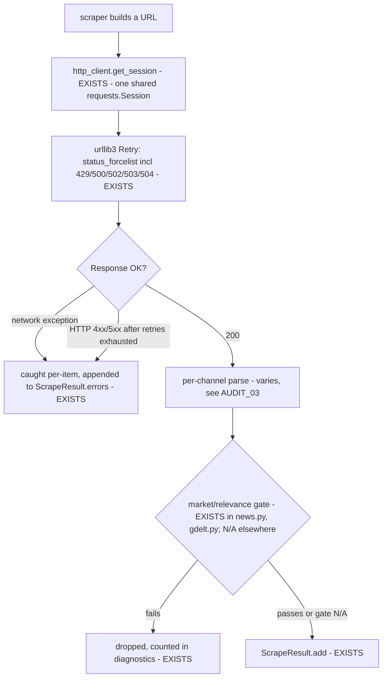
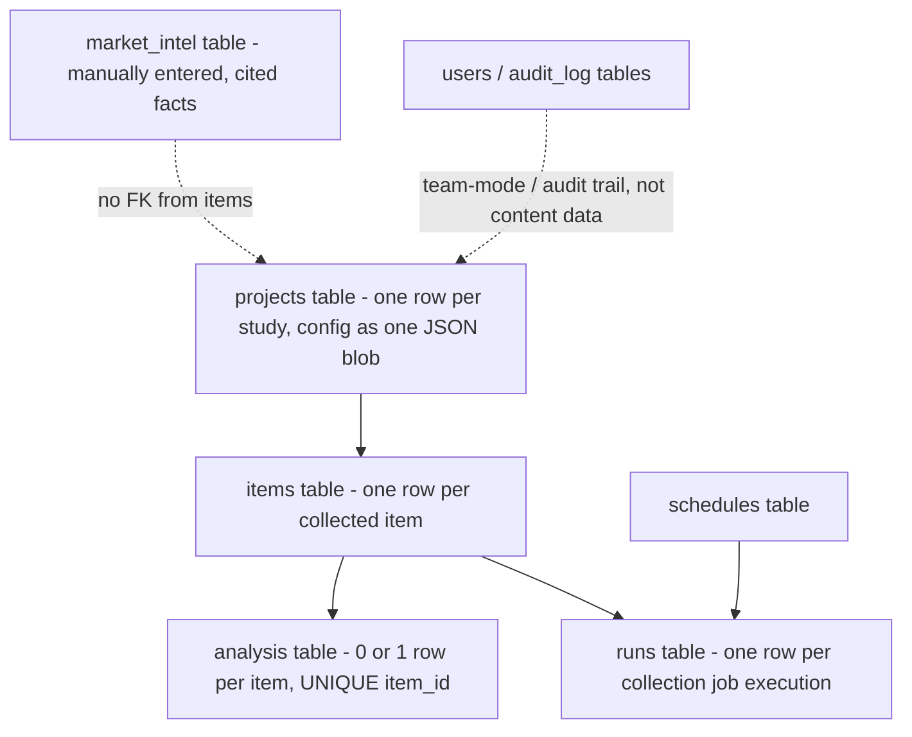
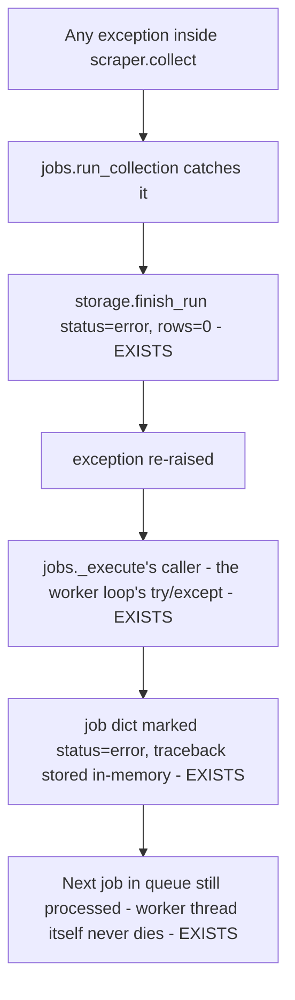
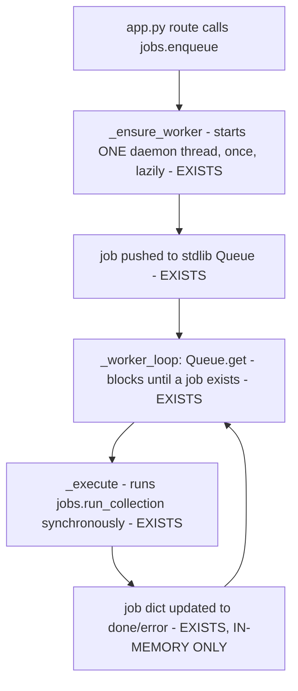

# AUDIT_01 — Architecture, Flow Diagrams, File-by-File Map

Reads `AUDIT_00_inventory.md` as prior context. All claims below are re-verified against the
actual files during this phase (see citations); nothing is carried over from Phase 0 without
re-confirmation where it matters architecturally.

---

## Section 1 — Executive summary

**What this system actually does:** MarketLens is a single-process, local-first web application
(FastAPI backend + a hand-written vanilla-JS single-page frontend, one SQLite database) that lets
one operator configure a "project" (a market + product/category + languages) via an intake wizard,
then run a fixed menu of **10 independent, pull-based collector modules** ("channels") against
that project's config, store whatever each one returns in one `items` table, optionally run a
Claude-based batch tagging pass over the stored items, and export the result as an Excel workbook
or a Markdown/Word report. It is a **scheduled/manual batch collector**, not a continuously-running
crawler and not a real-time streaming pipeline — every channel's `collect()` function
(`scrapers/<name>.py`) runs once per invocation, returns whatever it found, and exits; nothing
polls a live feed or listens for events (cite: `scrapers/base.py`'s `ScrapeResult` contract, and
`jobs.run_collection` in `jobs.py`, which calls `scraper.collect(cfg, params)` exactly once per
job and finishes the run when that one call returns).

**What it is designed to collect:** short-form web content — news articles (via RSS/Google
News/Bing News), Reddit posts+comments, generic forum posts, Quora question pages, e-commerce
product/review pages, YouTube videos+comments, Google Business reviews, Google Trends interest
data, GDELT event metadata, and (as a derived step) Claude-vision descriptions of images already
collected by the e-commerce channel. This is a **social/news/e-commerce listening tool for a
single configured brand or category in a single configured market**, not a general-purpose search
engine or a multi-tenant SaaS crawler.

**Expected scale, as designed:** the system's own one-click "Extensive research" feature (cite:
`app.py` `api_collect_extensive`, lines 355-378) frames its target unit of work as "a full-year,
monthly-chunked... collection" for **one project** — i.e. the design center is one market-research
study collecting up to roughly hundreds of items per channel per year, not a high-throughput
multi-tenant pipeline. There is no multi-project batching, no distributed workers, and (per
Phase 0) no message broker — see Section 2 below.

**Strongest parts (see Phase 4/6 for full quality assessment; noted here because they visibly
shape the architecture):**
- A single, uniformly-enforced scraper contract (`scrapers/base.ScrapeResult`, `collect(cfg,
  params) -> ScrapeResult`) that every one of the 10 channels implements identically, with all
  DB-writing centralized in one place (`jobs.run_collection`) rather than duplicated per channel.
- An explicit "never fabricate" convention enforced at the type level: a scraper can only return
  `items` (real) and `errors` (strings) — there is no code path for a channel to report a fake
  success.

**Weakest parts, architecturally (not yet a full quality rating — see Phase 6):**
- Job/queue state (`jobs.py`'s `_jobs` dict) is **process-memory only** — a process restart loses
  all job-status history (though the underlying `runs` table in SQLite, written by `storage.
  start_run`/`finish_run`, does survive; see Section 2).
- `CHANNEL_INFO` in `scrapers/__init__.py` (the user-facing description of each channel, shown in
  the UI) is **stale for at least one channel**: it describes Reddit as "public JSON" /
  "Public JSON only, no API key" (cite: `scrapers/__init__.py` lines 57-60), but the actual
  `scrapers/reddit.py` implementation exclusively fetches `.rss` endpoints — its own module
  docstring states the `.json` endpoint is dead ("As of Reddit's 2023 anti-scraping crackdown, the
  legacy unauthenticated `.json`..." — cite: `scrapers/reddit.py` lines 1-7). This is a genuine,
  verified documentation/code mismatch, not an inference.
- Single SQLite file, single FastAPI process, single background-thread job queue: there is
  architecturally **no path to horizontal scaling** without a rewrite of `storage.py`'s connection
  model and `jobs.py`'s in-memory queue (see Phase 5 for the scale ceiling this implies).

**Top architectural risks (surface-level; deepened in Phase 5/6):**
1. Job-status loss on process restart (above).
2. No lock/versioning on concurrent `PUT /api/projects/{pid}/config` writes — two browser tabs
   editing the same project's config could race (UNKNOWN at this phase whether this has been
   observed; flagged for Phase 5).
3. `CHANNEL_INFO` metadata drift (above) — a maintainability risk: the UI's own methodology text
   can silently diverge from what the code does.
4. Every one of the 10 channels does its own network I/O synchronously inside the single job-queue
   worker thread (`jobs._worker_loop`) — one slow/hanging external site blocks that channel's job
   but, because only one worker thread exists total, also blocks every *other* queued job for this
   process (see Phase 5).
5. No dependency lock file (Phase 0) — Docker and local dev can resolve different library versions
   for the same `requirements.txt`.

---

## Section 2 — Complete system architecture (as implemented, not generic)

```
┌─────────────────────────────────────────────────────────────────────────────┐
│  BROWSER (single static/index.html + static/app.js, no framework/build)     │
│  - State = {projectId, project, view, ...} held in one JS module-level obj  │
│  - fetch() calls to /api/* only; no websockets, no SSE                      │
└───────────────────────────────┬───────────────────────────────────────────┘
                                 │ HTTP (same origin, / and /api/*)
┌────────────────────────────────▼───────────────────────────────────────────┐
│  app.py — ONE FastAPI process (uvicorn, single worker, `python app.py`)     │
│                                                                             │
│  - StaticFiles mount serves static/* with Cache-Control: no-store          │
│    (app.py lines 54-64: an @app.middleware("http") hook)                   │
│  - require_user() Depends() on every /api route: no-op in solo mode,       │
│    session-cookie check in team mode (auth.py)                             │
│  - ~50 route functions defined directly in app.py (no router modules,      │
│    no blueprints) — grouped only by comment banners, e.g. "Projects +      │
│    wizard" (line 167), "Collection + jobs" (line 342), "Analysis" (447)    │
└──────┬───────────┬───────────┬────────────┬────────────┬───────────────────┘
       │            │           │             │            │
       ▼            ▼           ▼             ▼            ▼
 ┌──────────┐ ┌───────────┐ ┌─────────┐ ┌──────────┐ ┌──────────────┐
 │config.py │ │  jobs.py  │ │analysis │ │export.py │ │source_discovery│
 │(wizard,  │ │(in-proc   │ │  .py    │ │report.py │ │ / term_expansion│
 │ feed URL │ │ queue +   │ │(Claude  │ │(build    │ │ .py (Claude  │
 │ builders)│ │ 1 worker  │ │ batch   │ │ .xlsx /  │ │  suggestion   │
 │          │ │ thread)   │ │ tagging)│ │ .docx)   │ │  layers)      │
 └────┬─────┘ └─────┬─────┘ └────┬────┘ └────┬─────┘ └──────┬───────┘
      │              │            │           │              │
      │        ┌─────▼─────┐      │           │              │ anthropic SDK
      │        │ scrapers/ │      │           │              │ (HTTPS, external)
      │        │ __init__  │      │           │              │
      │        │ .get_     │      │           │              │
      │        │ scraper() │      │           │              │
      │        └─────┬─────┘      │           │              │
      │      ┌────────┼────────────────────────────┐         │
      │      ▼        ▼        ▼        ▼           ▼         │
      │   news.py  reddit.py forums.py ecommerce.py  ...      │
      │   gdelt.py quora.py youtube.py trends.py google_business.py
      │   image_analysis.py                                   │
      │      │        │        │        │           │         │
      │      └────────┴────────┴────────┴───────────┴─────────┤
      │        (each hits its own external HTTP endpoint/API   │
      │         via http_client.py's shared requests.Session,  │
      │         except ecommerce.py which drives Playwright/    │
      │         Chromium instead of requests)                  │
      │                                                        │
      └──────────────────────┬─────────────────────────────────┘
                              ▼
                     ┌──────────────────┐
                     │   storage.py     │  ← the ONLY module that touches SQLite directly
                     │  (raw sqlite3,   │     (every other module goes through it)
                     │   WAL mode)      │
                     └────────┬─────────┘
                              ▼
                     data/marketlens.db   (single file, single writer at a time
                                            enforced by jobs.py's single worker thread,
                                            NOT by SQLite-level locking config beyond
                                            its own default WAL behavior)
```

**Component table** (file/path → function/class → technology → responsibility → input → output →
depends on):

| Component | Key entry point | Technology | Responsibility | Input | Output | Depends on |
|---|---|---|---|---|---|---|
| Static SPA | `static/app.js` `render()` (line 284, per earlier session knowledge — re-confirmed structurally via section banners at lines 297/327/605/726/743/812/899/948/999/1035) | Vanilla JS, `fetch` | Renders one of 10 "views" based on `State.view`; all server communication via `/api/*` | User clicks/form input | `fetch()` calls | `app.py`'s `/api/*` routes only |
| `app.py` | `app = FastAPI(...)` (line 51) | FastAPI + Uvicorn | HTTP routing, auth gate, static hosting, startup wiring | HTTP requests | JSON / HTML / file responses | Every other top-level `.py` module (imported directly at module load, lines 19-30) |
| `config.py` | `run_wizard()`, `regenerate_news_feeds()`, `build_google_news_feeds()` | Pure Python, no I/O except `feed_health_check`'s live HTTP probe | Turns intake into a project config dict; builds News/Bing feed URLs; reference tables (countries/languages) | Wizard intake dict, existing config dict | Config dict | None (network only inside `feed_health_check`) |
| `jobs.py` | `enqueue()`, `_worker_loop()`, `run_collection()` | `threading`, stdlib `queue.Queue` | Serializes all collection runs through one background thread; wraps a channel's `collect()` with DB lineage writes | `(project_id, channel, params)` | In-memory job dict + `storage.runs`/`items` rows | `storage.py`, `scrapers.get_scraper()` |
| `scrapers/*.py` (10 modules) | each exposes `collect(cfg, params) -> ScrapeResult` | `requests`/`feedparser`/`playwright`/official SDKs per channel | Pull data from one external source, apply relevance/market gating, return items+errors | Project `cfg` dict, per-run `params` dict | `ScrapeResult(items, errors, diagnostics)` | `http_client.py` (all except `ecommerce.py`, which uses Playwright directly, and `image_analysis.py`, which uses `analysis.call_claude`) |
| `storage.py` | `save_items()`, `start_run()`/`finish_run()`, `get_project()` | raw `sqlite3` | All persistence: dedup by `content_hash`, near-dup clustering, run/job/audit bookkeeping | Python dicts/primitives | SQLite rows | `migrations.py` (schema), the `data/marketlens.db` file |
| `analysis.py` | `analyze_batch()`, `analyze_all()`, `call_claude()` | `anthropic` SDK | Batches 12 un-tagged items into one Claude prompt, parses JSON tags, writes to `analysis` table | Unanalyzed `items` rows | Rows in `analysis` table | `storage.py`, Anthropic API (external network) |
| `source_discovery.py` / `term_expansion.py` | `suggest_sources()` / `suggest_terms()` + `apply_expansion()` | `anthropic` SDK + `requests` (validation) | AI-propose new source URLs / keyword variants; validate before returning; a separate confirm step writes to config | Project config + a term/category string | Candidate lists (not yet applied) / an updated config dict | `analysis.call_claude` (both reuse it), `config.py` (`term_expansion` calls `regenerate_news_feeds` indirectly via `app.py`) |
| `export.py` / `report.py` | `build_workbook()` / `draft_report()`/`save_docx()` | `openpyxl` / `python-docx` | Read-only: query `storage`/`analytics` and render a file | Project id + optional date filter | `.xlsx` / `.md` / `.docx` file on disk | `storage.py`, `analytics.py` |
| `scheduler.py` | a background thread started in `app.py`'s `lifespan()` | `threading`, `time.sleep` loop | Polls a `schedules` table and calls `jobs.enqueue()` when a schedule is due | `schedules` table rows | New queued jobs | `storage.py`, `jobs.py` |

---

## Section 3 — Flow diagrams

### 3.1 Query flow (intake → config)


Stage status: every stage here EXISTS and is exercised by `tests/test_wizard.py` /
`tests/test_app.py`. There is no "query expansion" stage in this flow at all — the wizard captures
literal brand/category/competitor strings the user typed; any expansion into variants/brands/
translations is a **separate, manually-triggered, later action** (`term_expansion.py`), not part
of intake. See AUDIT_02 for the full query-expansion audit.

### 3.2 Discovery flow (finding WHAT to fetch, per channel)

```mermaid
flowchart TD
    P[Project config: source_plan.*] --> N[news.py: iterate google_news_feeds + bing_news_feeds + rss_feeds - EXISTS]
    P --> R[reddit.py: iterate configured subreddits x new/top/search.rss - EXISTS]
    P --> F[forums.py: iterate user-pasted thread URLs - EXISTS, no link-following/crawling]
    P --> E[ecommerce.py: iterate user-pasted product/search URLs or {q}-template x keywords - EXISTS]
    P --> Q[quora.py: iterate user-pasted question URLs - EXISTS, no discovery of new URLs]
    P --> G[gdelt.py: single DOC 2.0 API query, date-chunked - EXISTS]
    P --> Y[youtube.py: Data API search() by keyword - EXISTS]
    P --> GB[google_business.py: Places API text-search by brand+market - EXISTS]
    P --> T[trends.py: pytrends payload for configured keywords - EXISTS]
```
Discovery is uniformly **config-driven, not crawl-driven**: no channel follows outbound links to
discover new pages it wasn't explicitly told about, except News's own RSS/Google-News/Bing-News
*search* mechanism (a hosted search API/index, not a link-following crawler) and Reddit's search
endpoint. Forums, Quora, and e-commerce require the user to paste every specific URL (or a
`{q}`-template) up front — there is no sitemap parsing, no "find more forum threads like this
one" logic anywhere (confirmed absent by reading `scrapers/forums.py` and `scrapers/quora.py`'s
`collect()` functions in full in Phase 3).

### 3.3 Fetching flow (one HTTP round trip)


`ecommerce.py` does not go through `http_client.py` at all — it drives Playwright's own Chromium
browser (`sync_playwright()`), which has its own independent navigation/timeout/retry behavior,
not the `requests`+`urllib3.Retry` path used by every other channel (verified: `http_client.py`
constructs a `requests.Session`; `scrapers/ecommerce.py` was confirmed in the current session's
own prior work to call `sync_playwright()` directly).

### 3.4 Processing / normalize / dedup flow

```mermaid
flowchart TD
    A[scraper returns ScrapeResult.items - list of dicts] --> B[jobs.run_collection]
    B --> C[storage.save_items - EXISTS]
    C --> D[compute content_hash per item - EXISTS]
    D --> E{UNIQUE(project_id, content_hash) violated?}
    E -->|yes| F[counted as duplicate, row NOT inserted - EXISTS]
    E -->|no| G[insert row]
    G --> H[compute/assign cluster_id via title+date-window similarity - EXISTS, migration _m002]
    H --> I[items table row complete]
```
Stage status confirmed EXISTS end-to-end for dedup and clustering (both are load-bearing features
of this exact codebase, not a generic assumption) — full algorithm detail and edge-case testing
deferred to AUDIT_04 §2 (dedup) since that is this phase's explicit scope, not Phase 1's.

### 3.5 Storage flow


All content lives in exactly 2 tables (`items`, `analysis`) plus the append-only `runs` log; there
is no separate "raw" vs "processed" storage tier — `items.text` IS the processed/extracted text at
insert time (whatever each scraper decided to extract), and no earlier/rawer version is retained
once stored (see AUDIT_04 §1 for the explicit "is raw data preserved" determination).

### 3.6 Error/retry flow


This is a **job-level** (whole-`collect()`-call) retry/error boundary only. There is no per-item
retry-and-continue at this outer layer — a per-URL/per-item retry (e.g. one dead RSS feed among
five) is handled **inside** each scraper's own loop (confirmed present in `news.py`'s per-feed
`try/except` around `_collect_feed`, from prior session work) — full source-by-source detail is
AUDIT_03's explicit scope.

### 3.7 Worker/queue flow


**Concurrency model, precisely:** exactly one background thread ever calls `scraper.collect()`;
a second `enqueue()` call while one job is running just appends to the `Queue` and waits its turn
— confirmed by `_queue: "Queue[int]"` being a single unbounded FIFO and `_worker_loop` being
started exactly once (`_worker_started` flag + lock, `jobs.py` lines 36-45). There is no
async/concurrent execution of multiple channels even for the "Extensive research" one-click
multi-channel action — `api_collect_extensive` (`app.py` lines 355-378) enqueues N separate jobs
that the *same single worker thread* will still process one at a time.

---

## Section 4 — File-by-file map (execution-controlling files, Critical/High priority first)

| File | Purpose | Key functions/classes | Depended on by | Depends on | Importance |
|---|---|---|---|---|---|
| `app.py` | HTTP API surface, the only process entry point | `app` (FastAPI instance), `lifespan()`, ~50 route functions, `require_user()` | Browser (SPA) only | `analysis`, `analytics`, `archive`, `auth`, `config`, `export`, `jobs`, `market_intel`, `report`, `scheduler`, `storage`, `settings`, `version` | **Critical** |
| `jobs.py` | Serializes and executes every collection run | `enqueue`, `_worker_loop`, `_execute`, `run_collection` | `app.py`, `scheduler.py` | `storage`, `scrapers` | **Critical** |
| `storage.py` | Sole SQLite access layer | `save_items`, `start_run`/`finish_run`, `get_project`, `create_project`, dedup/cluster logic | `app.py`, `jobs.py`, `analysis.py`, `analytics.py`, `export.py`, `report.py`, `archive.py`, `market_intel.py`, `auth.py`, `scheduler.py` | `migrations.py`, stdlib `sqlite3` | **Critical** |
| `migrations.py` | Schema definition + evolution | `_m001_initial`, `_m002_story_clusters`, `MIGRATIONS` list | `storage.init_db()` (called from `app.py`'s `lifespan`) | none | **Critical** |
| `config.py` | Wizard + all keyword/feed-URL generation logic | `run_wizard`, `regenerate_news_feeds`, `build_google_news_feeds`, `build_bing_news_feeds`, `COUNTRY_TABLE`, `LANGUAGE_TABLE` | `app.py`, `term_expansion.py`, `scrapers/news.py` (imports `is_language_country_exclusive_enough`) | none (pure, except `feed_health_check`'s live probe) | **Critical** |
| `scrapers/__init__.py` | Channel registry + lazy dispatch | `_REGISTRY`, `CHANNEL_INFO`, `get_scraper`, `available_channels` | `jobs.py`, `app.py` (`/api/channels`) | `importlib` | **Critical** |
| `scrapers/base.py` | The shared scraper contract | `ScrapeResult`, `relevance_terms`, `languages` | Every file in `scrapers/` | none | **Critical** |
| `scrapers/news.py` | Largest single scraper; RSS/Google/Bing News | `collect`, `_collect_feed`, `chunk_date_ranges`, `market_signal` | `jobs.py` (via registry) | `http_client`, `scrapers.relevance`, `config.is_language_country_exclusive_enough` | **High** |
| `scrapers/reddit.py` | Reddit via `.rss` | `collect`, `parse_rss_posts`, `parse_rss_comments`, `_fetch_with_429_retry` | `jobs.py` (via registry) | `http_client` | **High** |
| `scrapers/ecommerce.py` | Playwright-driven marketplace scraper | `collect`, `_looks_blocked` | `jobs.py` (via registry) | `playwright` (not `http_client`) | **High** |
| `scrapers/relevance.py` | Content-relevance/boilerplate-stripping gate | `contains_any_term`, `term_appears_anywhere`, boilerplate strippers | `scrapers/news.py`, `scrapers/gdelt.py` (per registry cross-references) | `bs4` | **High** |
| `http_client.py` | Shared HTTP session + retry policy | `get_session()` | Every scraper except `ecommerce.py` | `requests`, `urllib3` | **High** |
| `analysis.py` | Claude tagging pipeline | `analyze_batch`, `analyze_all`, `build_prompt`, `call_claude` | `app.py`, `source_discovery.py`, `term_expansion.py` (all reuse `call_claude`) | `anthropic`, `storage` | **High** |
| `term_expansion.py` | AI term/keyword expansion | `suggest_terms`, `apply_expansion` | `app.py` | `analysis.call_claude`, `config.regenerate_news_feeds` (via `app.py`) | **High** (newest feature, directly shapes collectible volume) |
| `source_discovery.py` | AI source suggestion + validation | `suggest_sources`, `validate`, `discover_feed` | `app.py` | `analysis.call_claude`, `config.feed_health_check`, `http_client` | **High** |
| `static/app.js` | Entire frontend logic | `render()`, one `view*()` function per tab (10), `api()` fetch wrapper | Browser only | `app.py`'s `/api/*` surface | **High** |
| `analytics.py` | Aggregation queries for dashboard/export | `dashboard`, `sentiment_by_channel`, `brand_vs_competitor_sentiment` | `app.py`, `export.py` | `storage` (read-only SQL) | **Medium** |
| `export.py` | Excel workbook generation | `build_workbook` | `app.py` | `storage`, `analytics`, `openpyxl` | **Medium** |
| `scrapers/gdelt.py`, `forums.py`, `quora.py`, `youtube.py`, `trends.py`, `google_business.py`, `image_analysis.py` | Remaining 7 channel implementations | each: `collect` | `jobs.py` (via registry) | varies (see AUDIT_03) | **Medium** each |
| `report.py` | Markdown/.docx report builder | `draft_report`, `save_docx`, `save_markdown` | `app.py` | `storage`, `analytics`, `python-docx` | **Medium** |
| `market_intel.py` | Manual cited-fact CRUD | `add_cited_entry`, `manual_intelligence_plan` | `app.py` | `storage` | **Medium** |
| `archive.py` | `.mlz` export/import | `export_project`, `import_project` | `app.py` | `storage`, stdlib `zipfile` | **Medium** |
| `auth.py` | Team-mode session auth | `current_user`, `authenticate`, `bootstrap_admin` | `app.py` | `storage` | **Medium** |
| `scheduler.py` | Recurring-job trigger loop | a `while True` background thread | `app.py`'s `lifespan` | `storage`, `jobs.enqueue` | **Medium** |
| `settings.py` | Env-var config object | `settings` singleton | Nearly every module | `os.environ` | **Medium** |
| `seed_demo.py` | One-off demo-data script | — | Not imported by the app; run manually | `config`, `storage` | **Low** |

---

## Open questions for Phase 2

1. `config.py`'s intake flow only ever seeds `keywords.by_language[primary_language]` from the
   wizard's literal brand/category strings (`config.suggest_keyword_structures`, per Phase 0's
   citation) — Phase 2 needs to trace exactly what happens for a query like "coffee" end-to-end,
   including whether `term_expansion.py` (a *separate*, manually-triggered action) is the only
   mechanism that ever adds variant/brand/translation terms, or whether anything else in the
   pipeline does implicit expansion.
2. `scrapers/news.py` imports `config.is_language_country_exclusive_enough` — Phase 2/3 needs to
   fully characterize what "market gate" means for query results scoped to a single country, and
   whether multi-country-in-one-run is possible at all given `market.country` is enforced as a
   single string (`app.py` lines 196-210).
3. Is there any code path where a scraper discovers a URL it wasn't explicitly configured with
   (i.e., does News's RSS-search "count" as discovery-beyond-input, or is it still bounded by the
   literal keyword list configured)? Needs the literal `collect()` bodies read in full (deferred to
   Phase 2/3 by design).
4. `CHANNEL_INFO`'s Reddit description mismatch (Section 1) — are there other stale
   method/limitation strings in `scrapers/__init__.py` for the other 9 channels? Needs a
   side-by-side re-check against each channel's actual `collect()` body in Phase 3.
5. `http_client.py`'s retry policy (`status_forcelist` including 429) — Phase 3 needs the exact
   backoff numbers, and whether each channel's own additional retry logic (e.g. Reddit's
   `_fetch_with_429_retry`) composes with or duplicates it.
